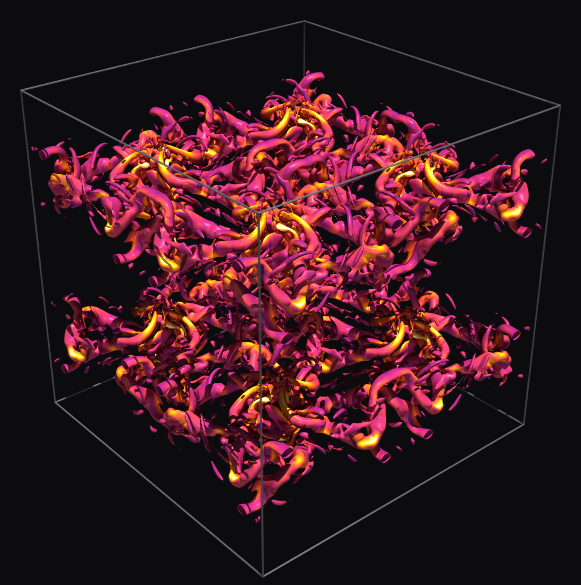

# microfd
How short can a very fast CFD code be? microfd is a 3D compressible Navier-Stokes solver in 237 lines of C: 1.2 ns per cell per step on one MI350X, 3.9 on one A100.



Finite volume on a uniform grid, WENO5-Z, HLLC, SSP-RK3, 2nd-order viscous terms, reflective free-slip adiabatic walls. Dimension-by-dimension, one Riemann solve per face, so formally 2nd order in multi-D with a WENO5 error constant. OpenMP target offload on NVIDIA and AMD, MPI decomposition, double precision. Needs a C compiler with offload, MPI, and Python + numpy for tests.

## Build
```
make                             # NVIDIA: nvc, ARCH=cc80
make amd ARCH=gfx90a             # AMD: amdclang; MK="amd ARCH=gfx90a" make test
```
`PATH` must hold the compiler and MPI `bin` directories. `EXTRA=-DHOST_MPI` stages halos through host memory; rebuild with `make -B`.

## Run
```
mpirun --mca coll_hcoll_enable 0 --mca pml ucx -x UCX_TLS=^cuda_ipc -np 4 ./microfd case=tgv nx=256 ny=256 nz=256 tend=10 ndiag=20 nout=500
```

| key | meaning | default |
|---|---|---|
| case | tgv, tgv2d, sod, sedov, vortex, acoustic | tgv |
| nx ny nz | global cells | 64 |
| px py pz | ranks per direction, 0 = automatic | 0 |
| x0 y0 z0, lx ly lz | domain origin and lengths | case |
| bcx bcy bcz | 0 periodic, 1 wall, 2 outflow | case |
| gamma, mu, pr | gas constants; mu=0 gives Euler | 1.4, case, 0.71 |
| cfl, tend | CFL number, end time | 0.5, case |
| ndiag, nout | steps between diagnostics lines and field outputs; nout=0 never | 10, 0 |
| axis | shock-tube axis for sod | 0 |

Unknown keys are an error. Diagnostics: `step t dt KE enstrophy maxMach ns/cell/step`, KE and enstrophy per cell, `dt` and `maxMach` from the previous step. Fields go to `out_NNNNNN.bin`, `[5][nz][ny][nx]` doubles rho u v w p, beside an `.xmf` ParaView opens. Ranks take GPUs by node-local rank modulo visible devices, so `CUDA_VISIBLE_DEVICES` / `ROCR_VISIBLE_DEVICES` place them. Peer GPU copies are corrupt on this A100 node, so the flags above exclude CUDA IPC; `MPIRUN` overrides the tests' launcher.

## Tests
`make test` runs `tests/test.py`: `tgv3d` takes minutes, `switches` rebuilds twice, `make -B` restores after an interrupt. `python3 test.py perf` reports throughput and weak scaling.

## Performance
TGV, viscous, one full SSP-RK3 step, each GPU at its fastest measured grid; published codes at the sizes they report. The last column rescales each time by peak HBM bandwidth over the A100 40GB's 1555 GB/s (A100 80GB 1935, MI210 and MI250X per GCD 1638, MI300X 5300, MI350X 8000); what remains is grid size and per-architecture efficiency.

| code | GPU | grid | ns per cell per step | at A100 40GB bandwidth | source |
|---|---|---|---|---|---|
| microfd | MI350X | 976^3, 930M cells | 1.20 | 6.17 | `make amd ARCH=gfx950` |
| microfd | MI300X | 256^3, 16.8M cells | 1.41 | 4.81 | `make amd ARCH=gfx942` |
| microfd | A100 80GB PCIe | 256^3, 16.8M cells | 3.92 | 4.88 | `python3 test.py perf` |
| microfd | MI250X (one GCD) | 592^3, 208M cells | 4.51 | 4.75 | `make amd ARCH=gfx90a` |
| microfd | MI210 | 576^3, 191M cells | 4.55 | 4.79 | as above |
| MFC, normalized to 5 PDEs | A100 | 8M cells | 8.9 | 8.9 | Wilfong et al. 2024 |
| STREAmS-2, WENO5 | A100 40GB | 33.6M points | 14.2 | 14.2 | Sathyanarayana et al. 2023 |

Grid size shifts these, and not in the same direction on every GPU: MI350X 1.51 at 256^3, MI300X 1.54 at 856^3 (143 of 191 GiB), A100 4.04 at 640^3 (262M cells, 63 of 80 GiB). MI300X and the A100 are fastest at 256^3; the others at fill size. MI350X strong scaling at 976^3: 1.20, 0.65, 0.34, 0.15 on 1, 2, 4, 8 GPUs; MI300X at 856^3: 1.53, 0.77, 0.40, 0.20. A100 weak scaling: 3.92, 4.27 (92%), 5.34 (73%) per GPU on 1, 2, 4. Memory is 240 B per cell, 30 fields of 8 B: a 64 GiB GPU holds roughly 630^3, a 287 GiB GPU 1050^3.

## License
Apache-2.0.
