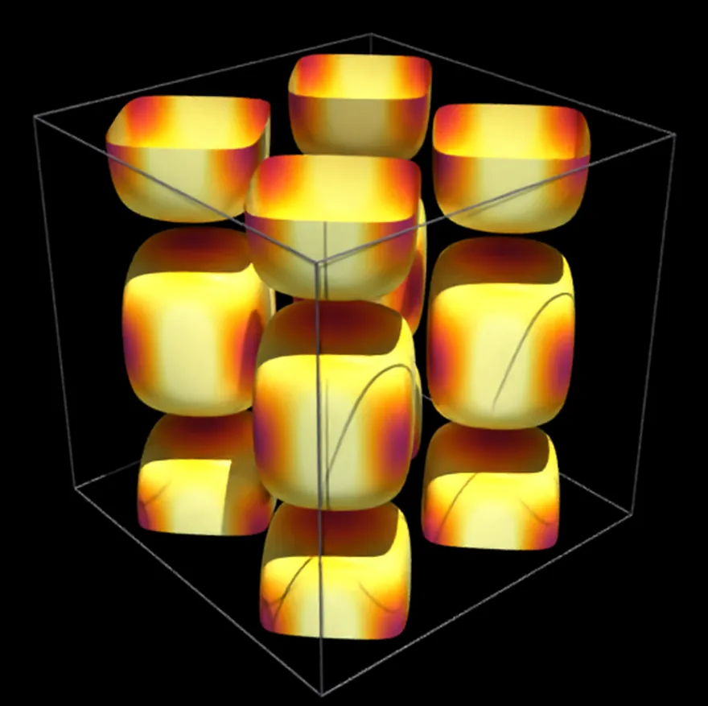
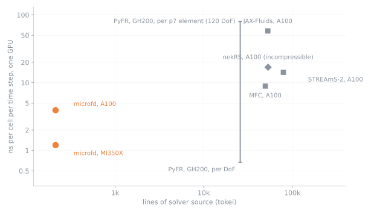

# microfd

[](https://github.com/sbryngelson/microfd/actions/workflows/ci.yml)


How short can a very fast CFD code be? 

microfd is a 3D compressible Navier-Stokes solver in one ~200 line C file. About 1.2 ns per cell per step on an AMD MI350X and 3.9 on A100.
So - faster than best reference times.



Finite volume, WENO5-Z, HLLC, SSP-RK3, viscous terms; OpenMP offload to NVIDIA, AMD, and Intel GPUs; GPU-aware MPI.

The reconstruction and the time step, as they appear in the file:
```c
static double weno5(double a,double b,double c,double d,double e){                 // WENO5-Z
  double b0=13./12*(a-2*b+c)*(a-2*b+c)+.25*(a-4*b+3*c)*(a-4*b+3*c);
  double b1=13./12*(b-2*c+d)*(b-2*c+d)+.25*(b-d)*(b-d);
  double b2=13./12*(c-2*d+e)*(c-2*d+e)+.25*(3*c-4*d+e)*(3*c-4*d+e);
  double t=fabs(b0-b2), w0=.1*(1+t/(b0+1e-16)), w1=.6*(1+t/(b1+1e-16)), w2=.3*(1+t/(b2+1e-16));
  return (w0*(2*a-7*b+11*c)+w1*(-b+5*c+2*d)+w2*(2*c+5*d-e))/(6*(w0+w1+w2));
}
static void update(double*out,double a,const double*qa,double b,const double*qb,double c){   // out = a qa + b qb - c div F; the divergence is fused in, so no rhs array
  LOCALS; const double*F=g.F; const double h0=g.h[0],h1=g.h[1],h2=g.h[2]; const size_t m=NV*nc;
  FOR3(NG,NG,NG,){ const long ci=IDX(i,j,k);
    for(int v=0;v<5;v++){ const size_t o=v*nc+ci;
      out[o]=a*qa[o]+b*qb[o]-c*((F[o]-F[o-1])/h0+(F[m+o]-F[m+o-sx])/h1+(F[2*m+o]-F[2*m+o-sy])/h2); } }
}
```

## Build and run
```bash
make                     # NVIDIA
make amd ARCH=gfx90a     # AMD
make pvc                 # Intel GPU Max
make cpu                 # CPU
mpirun -np 4 ./microfd case=tgv nx=256 ny=256 nz=256 tend=10 nout=500
make test
```

| key | meaning | default |
|---|---|---|
| case | tgv, tgv2d, sod, sedov, vortex, acoustic | tgv |
| nx ny nz | cells | 64 |
| px py pz | ranks per direction | auto |
| bcx bcy bcz | 0 periodic, 1 wall, 2 outflow | case |
| mu | viscosity, 0 for Euler | case |
| cfl, tend | CFL number, end time | 0.5, case |
| ndiag, nout | steps between diagnostics, field outputs | 10, never |

Output: `out_NNNNNN.bin` with `rho u v w p` as `[5][nz][ny][nx]` doubles, plus an `.xmf` ParaView opens.

`make cpu` drops `--offload-arch`, so the `target` regions run on the host and give the same answers. CI builds that way and runs `ic sod wall`, so a green badge covers the numerics and the MPI decomposition, not the offload path.

## Performance


Taylor-Green, viscous, double precision, ns per cell per step:

| | vendor | GPU | grid | ns |
|---|---|---|---|---|
| microfd | AMD | MI350X | 976^3 | 1.20 |
| microfd | AMD | MI300X | 256^3 | 1.41 |
| microfd | NVIDIA | H200 | 256^3 | 2.36 |
| microfd | NVIDIA | A100 80GB | 256^3 | 3.92 |
| microfd | AMD | MI250X, one GCD | 592^3 | 4.51 |
| microfd | AMD | MI210 | 576^3 | 4.55 |
| microfd | Intel | GPU Max 1100 | 512^3 | 5.13 |
| PyFR 2.0.3, compressible, p7 tets | NVIDIA | GH200 | 13.9M elements, 120 DoF each | 80 per element |
| MFC, normalized to 5 PDEs | NVIDIA | A100 | 8M cells | 8.9 |
| STREAmS-2, WENO5 | NVIDIA | A100 40GB | 33.6M points | 14.2 |
| nekRS, incompressible, p7 | NVIDIA | A100 40GB | 2.5M points | 16.9 |
| JAX-Fluids 2.0, WENO5-Z + HLLC | NVIDIA | A100 | 8 × 320^3 | 58.0 |

Published rows: Witherden et al. 2024 (6.0 GDoF/s per RHS evaluation, four per step assumed), Wilfong et al. 2024, Sathyanarayana et al. 2023, Min et al. 2023 (Table 1), Bezgin et al. 2024 (Table 9). Lines are the code lines of each solver's source directory.

## Not here
Uniform Cartesian grids only. Single-species ideal gas. Explicit time stepping. No AMR, immersed boundaries, reactions, turbulence models, etc.

## License
Apache-2.0
